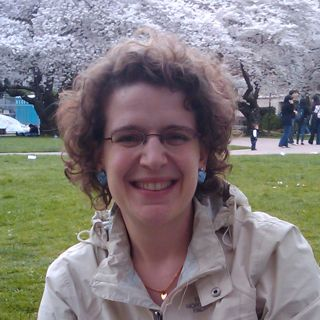
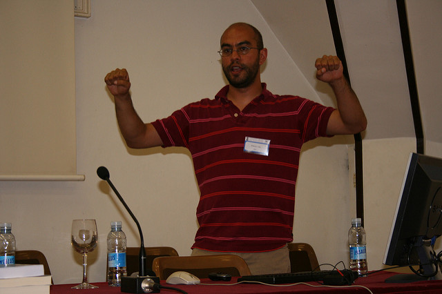
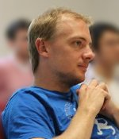
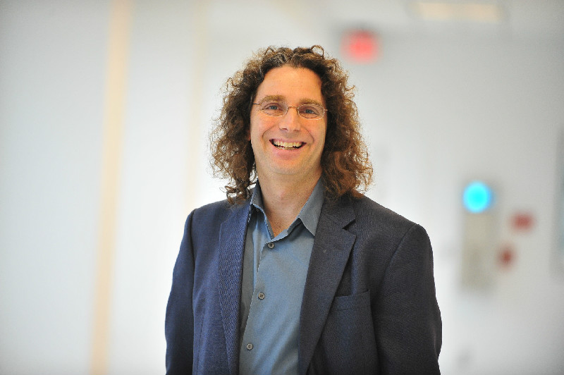



Officers
--------

|            |                 |                                  |           |
|------------|-----------------|----------------------------------|-----------|
| Chair      | Emily M. Bender | University of Washington         | 2016-2017 |
| Secretary  | Colin Cherry    | National Research Council Canada | 2016-2017 |
| Treasurer  | Joel Tetreault  | Yahoo Labs                       | 2017-2018 |
| Past Chair | Hal Daumé III   | University of Maryland           | 2014-2015 |

Executive Board
---------------

|              |                             |                           |           |
|--------------|-----------------------------|---------------------------|-----------|
| Board Member | Marie-Catherine de Marneffe | The Ohio State University | 2016-2017 |
| Board Member | Julia Hockenmaier           | University of Illinois    | 2016-2017 |
| Board Member | Philip Resnik               | University of Maryland    | 2017-2018 |
| Board Member | Ellen Riloff                | University of Utah        | 2017-2018 |

Ex-Officio Board Members
------------------------

|              |                       |               |
|--------------|-----------------------|---------------|
| Graeme Hirst | University of Toronto | ACL Treasurer |

Nominating Committee
--------------------

- Mona Diab (chair)
- Rebecca Hwa
- Anoop Sarkar
- Katrin Erk
- Julia Hirschberg
- Michael White
- Eduard Hovy

Chair (2016-2017) | [Emily M. Bender](http://faculty.washington.edu/ebender/) | University of Washington
-----------------------------------

#### Bio

Emily M. Bender is a Professor of Linguistics and an Adjunct Professor of Computer Science and Engineering at the University of Washington, where she has been a member of the faculty since 2003. Her primary research interests are in multilingual grammar engineering and deep linguistic processing. She is the Linguistic Society of America’s delegate to the ACL and the faculty director of UW’s professional MS in Computational Linguistics.

#### Candidacy Statement

I believe that science flourishes to the extent that we foster reproducibility, the open exchange of ideas, inclusivity and communication across and within disciplines. As NAACL Chair I would work to continue and expand on NAACL's excellent track record in these areas while also ensuring the organization continues to run smoothly.

Secretary (2016-2017) | [Colin Cherry](https://sites.google.com/site/colinacherry/) | National Research Council Canada
-------------------------------------------------

#### Bio

Colin Cherry is a Senior Research Officer at the National Research Council Canada. Previously, he was a Researcher at Microsoft Research. He received his Ph.D. in Computing Science from the University of Alberta. His primary research area is machine translation, but he has also been known to venture into parsing, morphology and information extraction. He is currently on the editorial board of Computational Linguistics, and has recently served as workshop co-chair for HLT-NAACL 2012, publications co-chair for HLT-NAACL 2013, and machine translation area co-chair for ACL 2014.

#### Candidacy Statement

The NAACL Secretary is responsible for helping to organize meetings, elections and general communications. This includes our presence on the web and on social media. The NAACL webpage has improved dramatically over the past few years, and my priority would be to keep it up-to-date and to make only small improvements; for example, by maintaining links to archives of previous conference’s webpages. In terms of social media, the NAACL twitter account has many followers, but only tweets a few times a year. I would like to draw up a policy describing the purpose of the NAACL’s social media accounts, so we can use them effectively and consistently to boost the signal for conferences, sponsored events, and NAACL-relevant news. As a board member, I look forward to participating in ongoing discussions on improving the conference reviewing process. I support current initiatives to encourage quality reviewing, and I like that we are carefully questioning the utility of the author response period. I am excited by our efforts to promote the study of language processing among students and developing regions, and I would be glad to continue these efforts, with a focus on making sure they receive sufficient attention.

Treasurer (2015-2016) | [Joel Tetreault](http://www.cs.rochester.edu/~tetreaul/) | Yahoo Labs
------------------------

#### Bio

Joel Tetreault is a Senior Research Scientist at Yahoo Labs in NYC. Previously he was Senior Principal Manager at Nuance Communications and Senior Managing Research Scientist at Educational Testing Service. His research interests include discourse processing, grammatical error detection, automated essay scoring, and dialogue systems. He received his PhD at the University of Rochester and was a postdoctoral researcher at the University of Pittsburgh before joining ETS. He is the current NAACL Treasurer, served as Area Chair for NAACL 2010, Session Chairs for NAACL/ACL 2010-2013, Exhibits Chair for NAACL 2012, co-organizes the Building Educational Applications workshop since 2008, and maintains the [primary conference calendar](http://www.cs.rochester.edu/~tetreaul/conferences.html) for our community (since 2004).

#### Candidacy Statement

The NAACL Treasurer monitors and reports on the finances of the organization, provides feedback to the NAACL board on which practices have been successful and how best to use our budget for the future. Over the last two years as NAACL Treasurer, my primary focus was to rebuild our bank account. A healthy bank account is important for two reasons. First, it allows us to fund important computational linguistics activities such as North American Computational Linguistics Olympiad (NACLO) and NLP conferences in emerging regions such as Central and South America. Activities such as these are likely to have a long-term effect on the growth of our field. Second, it allows us to better absorb any potential losses from a future NAACL conference. I worked with the rest of the NAACL board, Priscilla Rasmussen, and the previous treasurer, Chris Manning, to implement a sound strategy to rebuild our bank account. While our state of affairs has improved, there is still much work still to be done. If elected, I want to 1) continue with a conservative plan for our spending, 2) be aggressive and creative about seeking sponsorship and 3) minimize the risk of a conference operating at a loss.

Past Chair (2014-2015) | [Hal Daumé III](http://www.umiacs.umd.edu/~hal/) | University of Maryland
-----------------------------

#### Bio

Hal Daumé III is or was: an Associate Professor at UMD in CS and Linguistics; program co-chair of NAACL 2013; NAACL exec member; ed board member for CL, JAIR and MLJ; author of the NLPers blog; assistant professor at U of Utah; grad student at ISI; intern at Microsoft; sponsorship chair for NAACL; sponsorship and pubs chair for ICML; publicity chair for ACL and ICML; avid workshop organizer and tutorial giver; amazed you read this far; former co-director of the UMD CLIP lab.

#### Candidacy Statement

NAACL as a conference is great, and we can improve: reviewing, physical and virtual socialization, and memory of the past. NAACL as an organization is also fantastic, and we can take an active leadership role in promoting NLP/CL as a field within the Americas.

Board Member (2016-2017) | [Marie-Catherine de Marneffe](http://www.ling.ohio-state.edu/~mcdm/) | The Ohio State University
------------------------------------------------------

<image src="images/DeMarneffe.jpg" title="Marie-Catherine de Marneffe" height="150" />

#### Bio

Marie-Catherine de Marneffe is an Assistant Professor in Linguistics at The Ohio State University. She received her PhD from Stanford University in December 2012 under the supervision of Christopher D. Manning. Her research focuses on computational pragmatics. She is one of the principal developers of the Stanford dependencies and the Universal dependencies representations. She helped organize the shared task on Named-Entity recognition in Twitter at the ACL 2015 workshop on Noisy User-generated Text and is serving as an area chair for ACL 2016.

#### Candidacy Statement

In recent years, two focus areas of the NAACL board were the improvement of the reviewing process, both from the reviewers' and authors’ perspective, and a better integration between different disciplines. I will aim to continue the preceding efforts made in these directions. High quality reviews are a mandatory component of a successful and interesting conference. Incentives to ensure high quality reviewing have been put in place, but some of us have questioned how much author responses are taken into consideration, and this is something that can be concretely improved upon. Further I want to make sure our field stays true to its interdisciplinary nature, and stays grounded in the linguistics part of “computational linguistics”. NAACL should become a better illustration of how efforts in theoretical linguistics and NLP can complement each other, especially now that the field of Linguistics per se is becoming more and more quantitative. I will work to make this happen.

Board Member (2016-2017) | [Julia Hockenmaier](http://juliahmr.cs.illinois.edu/) | University of Illinois
------------------------------------

#### Bio

Julia Hockenmaier is an Associate Professor of Computer Science at the University of Illinois at Urbana-Champaign. She works on statistical parsing and grammar induction with expressive grammar formalisms, as well as on models that use NLP and computer vision to associate images with sentences that describe what is depicted in them. She has also worked on the application of parsing algorithms to protein folding. Julia received her PhD from the University of Edinburgh under the supervision of Mark Steedman, and did a postdoc with Aravind Joshi at the University of Pennsylvania. She is the SIGNLL secretary, co-chaired CoNLL 2013, was a member of the editorial boards of Computational Linguistics, and the ACM Transactions on Asian Language Processing, and is on the board of the Journal of Artificial Intelligence Research. She was on the Senior Program Committee of NAACL-HLT and EMNLP 2015, and is a regular member of the program committee for the various ACL conferences. She has participated in ACL/EACL/NAACL student research workshops as author, student organizer and faculty adviser, and was a member of the first EACL student board.

#### Candidacy Statement

As a member of the NAACL Executive Board, I would like to work towards securing the status of our conferences and workshops as an important place to present research, exchange ideas, and catch up with colleagues. Physical meetings are essential for the vitality of our community. But the format of the main conference needs to change to accommodate the growth of the field. Currently, only some papers get presented as long talks, and even the poster sessions are getting increasingly crowded. This is unfair, and clearly unsustainable. At CoNLL-2013, we gave every paper a 15-minute slot (and a poster). Despite some initial doubts, this worked very well. With three parallel sessions, we could accommodate up to 180 15-minute slots in a three day conference (that works out to five hours of talks per day, and would still leave time for invited speakers, and poster sessions in the evenings).

As our membership and conference attendance increase, our workshops have to play an increasingly important role. I would like to strengthen the role of both the Student Research Workshop and our regular workshops. The SRW needs to be known as a venue that promotes excellence in graduate research, and that fosters a sense of community among the next generation of CL/NLP researchers. Similar to e.g. the NIPS workshops, we should also encourage regular workshops that consist mainly of invited talks and discussions. There is no incentive to publish one's best work at a workshop, but it can be really productive and stimulating to get a group of people who are all working on similar topics in the same room for a day.

As a long term goal, I would also like to make sure that NAACL has a voice in public discussions that concern, and may shape, the future of computer science research and education in North America. I believe that (NA)ACL should consider joining the Computing Research Association (CRA), which would allow us to participate in such discussions, along with other professional societies such as AAAI, ACM, or SIAM.

Board Member (2017-2018) | [Philip Resnik](http://www.umiacs.umd.edu/~resnik/) | University of Maryland
------------------------------------

#### Bio

Philip Resnik is Professor of Linguistics at the University of Maryland, with a joint appointment at the University of Maryland Institute for  Advanced Computer Studies and an affiliate appointment in Computer Science. He received his bachelor's degree in Computer Science at Harvard in 1987, and his Ph.D. in Computer and Information Science at University of Pennsylvania in 1993, and joined the University of Maryland faculty in 1996. His industry experience prior to entering academia includes time in R&D at BBN, IBM T.J. Watson Research Center, and Sun Microsystems Laboratories. Philip's research focuses on computational modeling of language that brings together linguistic knowledge, domain expertise or knowledge resources, and data-driven methods, with a recent emphasis on applications in computational social science and other work in computational psycholinguistics, computational lexical semantics, and machine translation. Outside academia, Philip was a technical co-founder of CodeRyte (clinical natural language processing, acquired in 2012 by 3M), lead scientist for Converseon (spearheading development of their sentiment analysis platform, now marketed as ConveyAPI), and founded React Labs, which is commercializing research on scalable real-time response measurement and engagement using mobile devices.

#### Candidacy Statement

There are several issues I'd like to tackle as a member of the NAACL board. The first is how to improve the public profile of the organization. When there's a question or issue that involves vaccinations, journalists and policy makers want to know what the American Academy of Pediatrics has to say.  When there are discussions about gender identity, the views of the American Psychological Association show up. And so on. With the explosion of visible applications of language technology and increased public attention to issues in our domain, why are our organizations and community (NAACL and *ACL more broadly) not the go-to resource whenever people outside the community are seeking a well informed and relevant viewpoint? I'd like to explore ways the organization can increase its visibility and our impact as a community.

A second issue I've been thinking about -- wrestling with, really -- is the relationship between academic computational linguistics and the world of industry, especially startups. Questions like, what can we do to better prepare students in our community for jobs that are not traditional academic research positions? What lessons from the industry and startup worlds can we learn from that might improve the way we do research? Significant mobility between academic research training and non-academic jobs is a fact of our community and I'd like to see us add some explicit programming at upcoming conferences to address questions of this kind.

Third, the ability to build bridges with other communities is a huge opportunity for our own community, and I want to help figure out how we can do that more effectively -- building bridges has been a core interest of mine since early days bridging between the "statistical NLP" community and research driven by domain or linguistic knowledge.  I've been thinking about how our community can improve the bridges we build in order to increase impact, and where it might make sense to focus those efforts. An interesting recent experience, for example, was taking a leading role initiating the Computational Linguistics and Clinical Psychology (CLPsych) workshop series.  In those workshops we imported the notion of "discussants" from social science conferences, in order to restructure the traditional Q&A period in a way that fosters thoughtful cross-disciplinary conversation, and this might be a model worth experimenting with more broadly. (Another area I'm very invested in us connecting with more effectively is healthcare; I've been known to rant a bit about the barriers we face trying to have an impact there, thanks to limited access to electronic health records.)

Board Member (2017-2018) | [Ellen Riloff](http://www.cs.utah.edu/~riloff/) | University of Utah
------------------------------------

#### Bio

Ellen Riloff is a Professor of Computer Science at the University of Utah. She received her Ph.D. and M.S. in computer science from the University of Massachusetts at Amherst, and a B.S. in applied mathematics (computer science) from Carnegie Mellon University.  Her primary research areas are information extraction, sentiment analysis, semantic class induction, and bootstrapping methods that learn from unannotated texts. She has served on the Computational Linguistics Editorial Board, Transactions of the Association for Computational Linguistics (TACL) Editorial Board, as Program Co-Chair for the NAACL HLT 2012 and CoNLL 2004 conferences, and as Faculty Advisor for the ACL 2007 Student Research Workshop.

#### Candidacy Statement

It is an exciting time for the NLP community, with rapid growth and widespread interest in our technology! However, we are experiencing growing pains, most obviously in dealing with the increasing volumes of paper submissions and larger conferences. Our reviewer pools have been rapidly expanding, and I would like to see NAACL be more proactive about providing guidance to new reviewers.  One direction might be for NAACL to host a free/low-cost workshop or tutorial for young researchers that provides expectations for reviewing and offers general guidance for good reviewing standards. The resulting materials could later be distributed more widely on-line. As our growth continues, I believe that NAACL will also need to rethink the reviewing process. There are no easy answers, but I would encourage NAACL to explore ideas that may scale better than the current model, such as tiered reviewing.  Finally, the NAACL conferences have adapted well by having more parallel sessions, shorter presentation times, and large poster sessions.  In the coming years, I would like to see NAACL encourage an even greater diversity of research topics and approaches.  More emphasis could be placed on the value of highly creative and original research during reviewing, final paper selection, and at the conferences, perhaps by highlighting the most creative/original work in special sessions or adding new types of paper awards.

