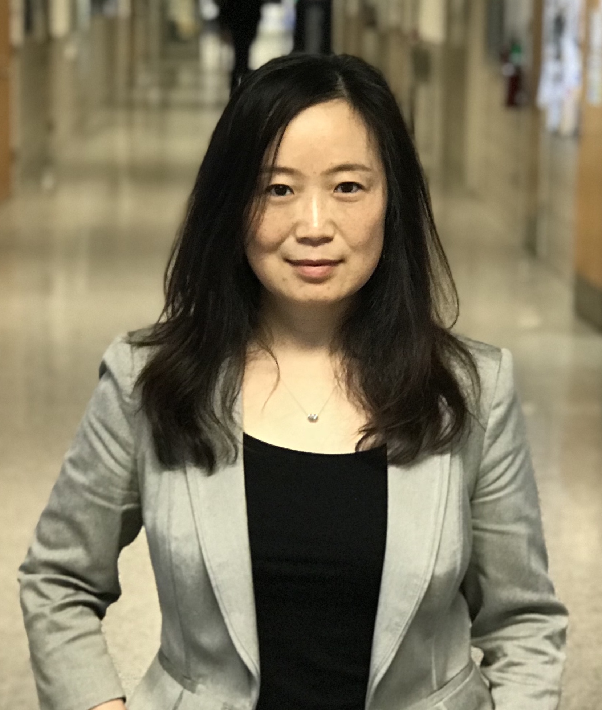



Officers
--------

|            |                  |                                         |           |
|------------|------------------|-----------------------------------------|-----------|
| Chair      | Julia Hockenmaier| University of Illinois                  | 2018-2019 |
| Secretary  | Colin Cherry     | Google                                  | 2018-2019 |
| Treasurer  | Jonathan May     | University of Southern California / ISI | 2019-2020 |
| Past Chair | Emily M. Bender  | University of Washington                | 2018-2019 |

Executive Board
---------------

|              |                             |                                        |           |
|--------------|-----------------------------|----------------------------------------|-----------|
| Board Member | Marie-Catherine de Marneffe | The Ohio State University              | 2018-2019 |
| Board Member | Marilyn Walker              | University of California at Santa Cruz | 2018-2019 |
| Board Member | Luke Zettlemoyer            | University of Washington               | 2018-2019 |
| Board Member | Joyce Chai                  | Michigan State University              | 2019-2020 |
| Board Member | Graham Neubig               | Carnegie Mellon University             | 2019-2020 |

Ex-Officio Board Members
------------------------

|               |                       |                          |           |
|---------------|-----------------------|--------------------------|-----------|
| ACL Treasurer | David Yarowsky        | Johns Hopkins University | 2018-2022 |

Nominating Committee
--------------------
- Michael White (chair)
- Eduard Hovy
- Matt Post
- Fei Xia
- Hal Daumé III

Chair (2018-2019) | [Julia Hockenmaier](http://juliahmr.cs.illinois.edu/) | University of Illinois
-----------------------------------

#### Bio

Julia Hockenmaier is an Associate Professor of Computer Science at the University of Illinois at Urbana-Champaign. She has been on the NAACL Executive Board since 2016, and is currently SIGNLL president. She is also an action editor for TACL, and was an area chair for NAACL 2015, EMNLP 2015, 2016 and 2017. Her research interests span many aspects of natural language understanding, from syntactic parsing and grammar induction with linguistically expressive grammars to image description and entailment recognition.

#### Candidacy Statement

Boy, do we live in exciting times! Since NLP has joined the deep learning revolution, we’ve achieved previously unheard of accuracies on established tasks that make much of “traditional” statistical NLP look as brittle as rule-based NLP must have seemed twenty years ago, and we keep reading about apparent breakthroughs in our field in the popular press, or in daily updates from the arXiv.  As NAACL chair, I would strive to make sure our organization makes the most of the opportunities that present themselves as our membership and commercial interest in our work explode, while also addressing the challenges that come with this rapid growth and maturation of the field. 

In particular, I would like to make sure that our conferences remain events that make it possible for newcomers and established members to meet, interact, and, well, form a community that they want to be a part of. It goes without saying that this should include anybody from the wide range of intellectual, national, and personal backgrounds that (NA)ACL attracts, regardless of whether they are students, faculty, government or industry researchers, or whether they consider themselves computational linguists or machine learning people, or which part of the Americas (or the rest of the world) they reside in. I would also like to strengthen relations with our neighboring disciplines, so that we can share best practices, e.g. for how to maintain double-blind reviewing standards when preprints have become pervasive, or for how to handle the glut of submissions we have to handle.
I would also like to strengthen the education and outreach work NAACL does through its Emerging Regions Fund and the scholarships for the Jelinek Summer Schools. Finally, as the technologies we create become increasingly commodified, and receive more and more attention in the popular press, I believe that our community has an increasing responsibility to inform the general public both of the actual capabilities of the systems we create, and of the ethical issues that may arise in their deployment. I would like (NA)ACL to promote the exchange and dissemination of ideas around these topics.

Secretary (2018-2019) | [Colin Cherry](https://sites.google.com/site/colinacherry/) | Google
-------------------------------------------------

#### Bio

Colin Cherry is a Research Scientist at Google. Previously, he has worked at National Research Council Canada and Microsoft Research. He received his Ph.D. in Computing Science from the University of Alberta. His primary research area is machine translation, but he has also been known to venture into parsing, morphology and information extraction. He is currently secretary for the NAACL and an action editor for the Transactions of the ACL. He has recently served as workshop co-chair for HLT-NAACL 2012, as publications co-chair for HLT-NAACL 2013, on the editorial board of Computational Linguistics from 2013 to 2015, and as machine translation area co-chair for ACL 2014 and IJCNLP 2017.

#### Candidacy Statement

The NAACL Secretary is responsible for helping to organize meetings, elections and general communications, including the website and social media. As secretary, I’ve done what I can to keep these things running smoothly, including managing a shift of naacl.org to a new markdown language. As a board member, I was part of the organizing team for awarding NAACL-sponsored scholarships to attend the 2017 Jelinek Summer School.

I am generally happy with the NAACL web site and our election process. The secretary responsibility with the greatest room for improvement continues to be NAACL’s use of social media. The organization’s Twitter account has previously been used only to announce the executive’s direct activities. This year, I will extend the account’s role to aggressively promote the social media activities of the NAACL conference. Going beyond that with social media raises the question of what role, if any, NAACL should play in promoting and commenting on general news about natural language technologies in North America. This question is increasingly important as the impact of our technologies grows. It is not a straightforward question, but it is the sort of thing I’d like to help us figure out if given a second term. 

As a board member, I would also like to continue to make our conferences family friendly. At this year's ACL, we made big steps toward this by providing on-site child care. I'd like to also look into providing support to families that don't necessarily want child care, by providing space or activities to allow children and spouses to get to know each other. 

I have greatly enjoyed my time as NAACL Secretary, and I sincerely hope you’ll give me the chance to serve for another two years.

Treasurer (2019-2020) | [Jonathan May](http://jonmay.net) | University of Southern California / Information Sciences Institute
------------------------

#### Bio

Jonathan May is a Research Assistant Professor in the Computer Science Department of the Viterbi School of Engineering at the University of Southern California, as well as a Computer Scientist with USC's Information Sciences Institute, where he received his PhD in 2010. He has previously worked at BBN Technologies and at Language Weaver (now SDL Research). His research interests include automata theory, machine translation, semantic parsing, and machine learning. He is currently a co-organizer of the SemEval workshop. Jon previously served as an Area Chair and as Handbook Chair for NAACL 2018, social media co-chair for NAACL in 2016, and local arrangements co-chair for NAACL in 2010.

#### Candidacy Statement

Thank you for considering me for the position of NAACL treasurer. When I was asked to run for this position, the first thing I thought of was how fun the job sounds. No, I’m not kidding! I actually enjoy the logistics and the satisfaction of getting everything into place, which I do a lot as a PI of several large grants and an instructor of a large class. That's given me experience in keeping complicated budgets on target, planning ahead, and communicating our progress to the people who need to know.

I also have experience with ACL leadership positions. I’m finishing my tenure as SemEval co-organizer, which requires lots of coordination with many of the people I’d be working with on the NAACL board. Last year I was the (emergency) handbook chair of NAACL, with a compressed schedule of one week. I really enjoyed the logistics and the satisfaction of getting everything into place. There’s something so soothing about perfectly balanced books, like a compiled paper draft that just fits the page limit.

I have plans for improving NAACL as treasurer while continuing the great work done by the current board. I’d like to increase sponsorship of registration fees, continue to support subsidized on-site childcare, continue to support NACLO to promote Computational Linguistics at the high school level, and, where possible, expand the previous board initiatives to support participation in emerging regions, particularly in Mexico, Central, and Southern America. These efforts will help increase diversity in conference attendees and ensure that we have the financial stability we need. However, I will continue the board’s policy of cautious and prudent spending to slowly grow our account to pre-2010 levels without sacrificing the great conference experience we all look forward to.

Past Chair (2018-2019) | [Emily M. Bender](http://faculty.washington.edu/ebender/) | University of Washington
-----------------------------

#### Bio

Emily M. Bender is a Professor of Linguistics and an Adjunct Professor of Computer Science and Engineering at the University of Washington, where she has been a member of the faculty since 2003. Her primary research interests are in multilingual grammar engineering and deep linguistic processing. She is the Linguistic Society of America’s delegate to the ACL and the faculty director of UW’s professional MS in Computational Linguistics.

#### Candidacy Statement

I believe that science flourishes to the extent that we foster reproducibility, the open exchange of ideas, inclusivity and communication across and within disciplines. As NAACL Chair I would work to continue and expand on NAACL's excellent track record in these areas while also ensuring the organization continues to run smoothly.

Board Member (2018-2019) | [Marie-Catherine de Marneffe](http://www.ling.ohio-state.edu/~demarneffe.1/) | The Ohio State University
------------------------------------------------------

<image src="images/DeMarneffe.jpg" title="Marie-Catherine de Marneffe" height="150" />

#### Bio

Marie-Catherine de Marneffe is an Assistant Professor in Linguistics at The Ohio State University. She received her PhD from Stanford University in December 2012 under the supervision of Christopher D. Manning. Her research focuses on computational pragmatics. She is one of the principal developers of the Stanford Dependencies and the Universal Dependencies representations. She helped organize the shared task on Named-Entity recognition in Twitter at the ACL 2015 and Coling 2016 workshops on Noisy User-generated Text, and co-chaired with Joakim Nivre the first workshop on Universal Dependencies in 2017. She served as an area chair for ACL 2016. She is currently a member of the NAACL board as well as of the Computational Linguistics editorial board.

#### Candidacy Statement

In recent years, the NAACL board aimed at the improvement of the reviewing process and paper selection, a better integration between different disciplines, and the inclusion of all of the Americas. In the last two years, I have worked, together with other board members, towards these three goals (for instance, Hal Daumé III and I organized the author response survey, which led to recommendations to program chairs; I helped Joel Tetreault with the Emerging Region Fund). By continuing to serve on the board, I can materialize the efforts started. I also want to make sure that our field stays true to its interdisciplinary nature, and stays grounded in the linguistics part of "computational linguistics". NAACL has to become a better illustration of how research in theoretical linguistics and NLP can complement each other. I will continue to work to make this happen.

Board Member (2018-2019) | [Marilyn Walker](https://users.soe.ucsc.edu/~maw/) | University of California at Santa Cruz
------------------------------------------------------

<image src="images/lyn_walker.jpeg" title="Marilyn Walker" height="150" />

#### Bio

Marilyn Walker is a Professor of Computer Science at the University of California at Santa Cruz. Her current research includes work on computational models of dialogue interaction and conversational agents, statistical and expressive natural language generation, analysis of social phenomena in social media dialogue, and research on the analysis and generation of narratively structured texts. Walker was a professor of Computer Science at the University of Sheffield from 2003 to 2009 where she held a Royal Society Wolfson Award. From 1996 to 2003, she was a principal member of the research staff at AT&T Bell Labs and AT&T Research, where she focused on statistical methods for dialogue management and statistical natural language generation. She earned a B.A. in Computer and Information science at UC Santa Cruz, an M.S. in Computer Science at Stanford University, and M.A. in Linguistics and Ph.D. in Computer and Information Science at the University of Pennsylvania.

#### Candidacy Statement

This is an exciting time for the NLP community with the rapid growth and expansion in the field. Our first NAACL conference, only 17 years ago, had eight area chairs and received 166 submissions. In 2018 we will have around 65 area chairs with a guestimate of getting possibly more than 1500 submissions. The downside of this rapid growth is maintaining the quality of the conference, along with the potential for change in the culture and feeling of our community.

This community has always been one of the most diverse sub-areas of computer science and that is something that is valuable: we have to work to maintain and nourish this diversity.  I will continue to support and work on the initiatives that recently resulted in changes to the ACL constitution to enforce more gender and geographical diversity and the establishment of the Women in NLP workshop.

We need to make an explicit attempt to value our roots. We could consider establishing a Test of Time award for work published in NAACL more than ten years ago. As we grow we do not want to lose the valuable contributions from scientists in other disciplines that have always had a core interest in human language.

Finally, I hope to work towards methods and approaches by which NAACL can explicitly encourage an even greater diversity of research topics and approaches. We need to encourage reviewers to place greater weight on highly creative and original research, and area chairs to prioritize the final selection of papers that are both well-grounded in the literature and very creative. We could expand the idea of best paper awards to have special sessions that would highlight the most creative and original work, perhaps by explicitly adding new types of paper awards.

Board Member (2018-2019) | [Luke Zettlemoyer](https://www.cs.washington.edu/people/faculty/lsz) | University of Washington
------------------------------------------------------

<image src="images/lsz_sm.jpg" title="Luke Zettlemoyer" height="150" />

#### Bio

Luke Zettlemoyer is an Associate Professor in the Allen School of Computer Science & Engineering at the University of Washington, and also runs the AllenNLP group at the Allen Institute for Artificial Intelligence. His research focuses on empirical computational semantics, covering a wide range of core language understanding problems such as semantic parsing and coreference resolution. He has served the *ACL community for over 10 years, as reviewer, area chair, and action editor for various conference and journals. He has never served on a board, but would be happy to do so if elected.

#### Candidacy Statement

NAACL is a healthy, growing community. I think that, overall, we should be careful to maintain the high quality of the conference, while making incremental adjustments to improve reviewing quality, inclusiveness, institutional memory, support for interdisciplinary research, and recognition of high quality work.

Board Member (2019-2020) | [Joyce Chai](http://www.cse.msu.edu/~jchai/) | Michigan State University
------------------------------------

#### Bio

Joyce Chai is a Professor in the Department of Computer Science and Engineering at Michigan State University, where she directs the Language and Interaction Research Lab. Prior to joining MSU in 2003, she was a researcher at IBM T. J. Watson Research Center. Her research interests include natural language processing, situated dialogue agents, information extraction and retrieval, and intelligent user interfaces. Her recent work has focused on grounded language processing to facilitate situated communication with robots and other artificial agents. Throughout the years, she has served on many conference/workshop organizations in different roles. More recently, she served as Program Co-chair for the Special Interest Group in Dialogue and Discourse (SIGDIAL) in 2011, the ACM International Conference on Intelligent User Interfaces (IUI) in 2014, and the North America Chapter of ACL – Human Language Technology (NAACL-HLT) in 2015. She holds a Ph.D. in Computer Science from Duke University.

#### Candidacy Statement

I have two goals in joining the NAACL executive board. First, I would like to work with the board to seek more opportunities to broaden interdisciplinary participation. We should find ways to encourage more interdisciplinary work at NAACL, for example, in the intersection of language, vision, robotics, and cognitive modeling. We should continue to reach out to relevant communities and actively solicit and invite interdisciplinary workshop/tutorial proposals for NAACL. We can also collocate our annual meeting with other major conferences in related areas and jointly create opportunities (e.g., brown bag lunches at the meeting) for interested researchers to meet and connect. Second, I would like to explore ways that NAACL can help encourage young researchers to enter academia and help them make a successful transition. NAACL can provide a platform to connect junior faculty and senior people. For example, NAACL can host a gathering at its annual conference to bring junior/senior people together to share experiences in NLP pedagogy, student supervising, grant writing, work-life balance, and other issues related to an academic career.

Board Member (2019-2020) | [Graham Neubig](http://www.phontron.com) | Carnegie Mellon University
------------------------------------

#### Bio

Graham Neubig is an assistant professor at the Language Technologies
Institute of Carnegie Mellon University. His work focuses on natural
language processing, specifically multi-lingual models that work in
many different languages, and natural language interfaces that allow
humans to communicate with computers in their own language. Much of
this work relies on machine learning to create these systems from
data, and he is also active in developing methods and algorithms for
machine learning over natural language data. He is also active in
developing open-source software, and is the main developer of the
DyNet neural network toolkit.

He publishes regularly in the top venues in natural language
processing, machine learning, and speech, and his work occasionally
wins awards such as best papers at EMNLP and EACL. He is frequently an
area chair for conferences such as NAACL, ACL, COLING, and ICLR. He
also was the founder of multiple ACL-affiliated workshops, most
recently the Workshop on Neural Machine Translation.

#### Candidacy Statement

I think NAACL has a lot to be proud of, particularly its premier
high-impact conference that is growing year-by-year. However, I think
there are growing pains related to being part of such a burgeoning
field. While there are undoubtedly a wide variety of issues facing
NAACL, in particular there are two that I would like to advocate for:
maintaining quality of the reviewing process, and better mechanisms
for remote participation in conferences:

First, with regards to reviewing, how can we ensure that our community
can strive for the best results possible given the constraints on time
that we will inevitably have to deal with? Also, how can we make it
the most pleasant experience possible for all parties? Some
preliminary ideas I have on this front include the following:

1. It would be nice if reviewers could review papers that match their
interests. We could help ensure this is the case by introducing
automatic tools for matching reviewers to papers such as the Toronto
Paper Matching System.
2. Given the rapid expansion of the field and more junior reviewers,
it would be nice to ensure that we have a good mix of junior and
senior reviewers on each paper. We could keep track of the career
stage of each reviewer, and consider this in allocations. It would
also be useful overall to have a more formal process of maintaining
information about who reviewed for which conferences under which
areas.
3. I strongly believe that author responses and the resulting
discussion make the review process better, but feel we lack
transparency in this process. Perhaps we could make post-response
discussions public to the authors so they could understand what went
in to making the decisions.
4. I think the simple but structured review form we saw in EMNLP 2018
(which was in turn inspired by NAACL 2018) was a huge step forward. I
would propose adding one more box to the form on "constructive
suggestions for future work". I think this would make the review
process more friendly and beneficial for all parties.

I don't think that we can expect conference or area chairs to
implement each of these processes manually, so coming up with
systematic and automated ways of doing so that are passed down
conference-by-conference is imperative.

Second, I would like to consider methods for improving remote
participation in conferences. We live in an age where it is now very
possible to broadcast our events online, which would be a great boon
to those who could not attend the conference. I would specifically
like to consider the following improvements:

1. Live broadcasts of talks in all of the sessions. Depending on
budgetary constraints, this could be done more formally through the AV
people at the venue, or informally through simple streaming services
staffed by volunteers.
2. Contingent on 1., we could also use a live internet Q&A site to
allow people who were joining remotely to ask questions, and have
other participants vote on the questions they were most interested in.
3. Finally, given that many people cannot join the conference for
visa, financial, or personal reasons, I would like to consider
allowing some subset of the presenters to make their presentations
remotely.

