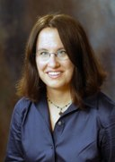
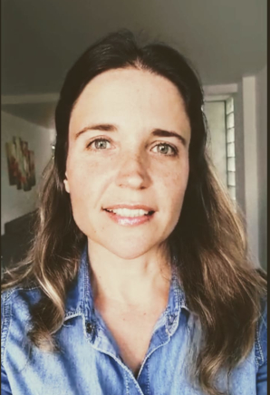



Officers
--------

|            |                  |                                            |           |
|------------|------------------|--------------------------------------------|-----------|
| Chair      | Colin Cherry     | Google                                     | 2020-2021 |
| Secretary  | Heng Ji          | University of Illinois at Urbana-Champaign | 2020-2021 |
| Treasurer  | Jonathan May     | University of Southern California / ISI    | 2021-2022 |
| Past Chair | Julia Hockenmaier| University of Illinois at Urbana-Champaign | 2020-2021 |

Executive Board
---------------

|              |                             |                                            |           |
|--------------|-----------------------------|--------------------------------------------|-----------|
| Board Member | Luciana Benotti             | Universidad Nacional de Córdoba            | 2021-2022 |
| Board Member | Smaranda Muresan            | Columbia University                        | 2020-2021 |
| Board Member | Graham Neubig               | Carnegie Mellon University                 | 2021-2022 |
| Board Member | Thamar Solorio              | University of Houston                      | 2020-2021 |
| Board Member | Aline Villavicencio         | Federal University of Rio Grande do Sul and the University of Sheffield | 2020-2021 |
                                              

Ex-Officio Board Members
------------------------

|               |                       |                          |           |
|---------------|-----------------------|--------------------------|-----------|
| ACL Treasurer | David Yarowsky        | Johns Hopkins University | 2018-2022 |

Nominating Committee
--------------------
- Philip Resnik (chair)
- Emily Bender
- Hal Daumé III
- Marie-Catherine de Marneffe
- Ellen Riloff
- Marilyn Walker 
- Luke Zettlemoyer.

Chair (2020-2021) | [Colin Cherry](https://sites.google.com/site/colinacherry/) | Google
----------------------------------------------------------------------------------------

#### Bio

Colin Cherry is a Research Scientist at Google in Montreal. Previously, he
worked at Natural Research Council Canada and Microsoft Research. He received
his Ph.D. in Computing Science from the University of Alberta. His primary
research area is machine translation, but he has been known to venture into
parsing, morphology and information extraction. He is currently secretary for
the NAACL and an action editor for the Transactions of the ACL. He has served as
a workshop chair for HLT-NAACL 2012, as a publications chair for HLT-NAACL 2013,
on the editorial board of Computational Linguistics from 2013 to 2015, and as an
area chair for ACL 2014, IJCNLP 2017 and EMNLP 2019. He co-organized the
Workshop on Deep Learning Approaches for Low-Resource NLP (DeepLo) in 2018 and
2019, and he was Research Program co-chair for the conference of the Association
for Machine Translation in the Americas (AMTA) in 2018.

#### Candidacy Statement

From what I have seen, the role of the NAACL chair is threefold: first to keep
the NAACL board on track with its recurring responsibilities of conference
organization and community outreach, second to act as a liaison between the
NAACL and the ACL, and third to enable and amplify the great ideas of NAACL’s
board members. As a chair candidate, my primary advantage is having served as
secretary for two great NAACL chairs. Over the past four years, I have watched
them do these things expertly, and if selected as chair I will endeavour to do
the same.

In terms of a platform, I mostly offer continuity and stability. These are
extraordinary times for natural language processing, and I have no illusions
about the amount of effort required just to scale our conferences and outreach
to match our field’s rapid growth. I will continue to support NAACL’s widespread
efforts to make its conferences more inclusive, by reducing financial barriers
for disadvantaged groups, continuing to refine our strategies for
family-friendliness, and improving the accessibility of our venues. I also
intend to prioritize a careful discussion of how to handle remote presentation
properly and consistently. Reviewing, of course, remains an ongoing concern as
we attempt to scale our processes to an ever-growing flood of submissions. I
will ensure that the NAACL board remains actively engaged in this discussion as
it continues in our community and in those of our neighbouring fields.

Secretary (2020-2021) | [Heng Ji](http://blender.cs.illinois.edu/hengji.html) | University of Illinois at Urbana-Champaign
--------------------------------------------------------------------------------------------------------------------------

#### Bio

Heng Ji is a professor at Computer Science Department of University of Illinois
at Urbana-Champaign. She received her B.A. and M. A. in Computational
Linguistics from Tsinghua University, and her M.S. and Ph.D. in Computer Science
from New York University. Her research interests focus on Natural Language
Processing, especially on Information Extraction and Knowledge Base
Population. She is selected as "Young Scientist" and a member of the Global
Future Council on the Future of Computing by the World Economic Forum in 2016
and 2017. The awards she received include "AI's 10 to Watch" Award by IEEE
Intelligent Systems in 2013 and NSF CAREER award in 2009. She has coordinated
the NIST TAC Knowledge Base Population task since 2010. She is the associate
editor for IEEE/ACM Transaction on Audio, Speech, and Language Processing. She
has served as the Program Committee Co-Chair of NAACL-HLT2018, NLP-NABD2018,
NLPCC2015, CSCKG2016 and CCL2019, and senior Information Extraction area chair
for many ACL conferences.

#### Candidacy Statement

As one of the top three Computational Linguistics conferences, NAACL has created
a nice culture of openness, fairness and efficiency in the community. However,
NAACL’s exponential growth is making it increasingly difficult for authors to
gain visibility for their research, find relevant papers, new members to find
mentors, for program chairs to identify conflicts of interest (COI) and match
papers with reviewers. I will focus on the following initiatives.

1. To improve career and paper mentorship matching and general information
   sharing, I will closely work with Softconf and NAACL board to
   semi-automatically build and update a comprehensive NAACL member profile
   knowledge base: (a). A NAACL member can choose if they want a profile;
   (b). Use Information Extraction along with crowd-sourcing techniques to
   disambiguate entities and extract profiles, by integrating multiple sources
   (Softconf, ACL Anthology, webpages, Google Scholar pages, and conference
   pages); (c). Work with Softconf to integrate this knowledge base into
   Softconf, update it over time, and post it on the NAACL website; (d). Get
   input from NAACL board and/or community to create mailing lists (by area and
   subarea) to enable more focused resource sharing and discussions;

2. I will also contribute constructive ideas and techniques to NAACL and ACL
   committees on improving paper COI handling, review matching, review quality
   control process and author disambiguation and paper search, again by
   leveraging my expertise in Information Extraction and the problems I have
   observed from being a recent NAACL2018 PC co-chair.

3. When Amanda Stent and I were co-chairing the NAACL2018 PC, we greatly
   benefitted from the guidelines propagated from former conference chairs and
   we also wrote many guidelines/handbooks at each step for PC chairs and area
   chairs. I will work with NAACL conference chairs to collect all relevant
   materials and integrate them into a common reference repository to share with
   future chairs of NAACL and conferences in other regions and countries.

4. For the basic duties, I will handle external communications through the NAACL
   website, mailing lists and social media in a clear and timely manner, take
   detailed and well-organized minutes at meetings, and run elections in a
   well-organized, fair and transparent format. The relevant services I have
   done in the past include proposing and organizing the nomination and
   selection of the Test-of-time award at NAACL2018, leading several
   multi-institute research efforts, and coordinating NIST TAC-KBP for ten
   years.

Treasurer (2021-2022) | [Jonathan May](http://jonmay.net) | University of Southern California / Information Sciences Institute
------------------------

#### Bio

Jonathan May is a Research Assistant Professor in the Computer Science Department of the Viterbi School of Engineering at the University of Southern California, as well as a Research Lead with USC’s Information Sciences Institute, where he received a PhD in 2010. He has previously worked at BBN Technologies and at Language Weaver (now SDL Research). His interests include automata theory, machine translation, common-sense reasoning, semantic parsing, and dialogue. He is currently treasurer of NAACL. Jon previously served as workshop co-organizer and task organizer of SemEval from 2016 to 2019, handbook chair for NAACL 2018, social media co-chair for NAACL in 2016, and local arrangements co-chair for NAACL in 2010.

#### Candidacy Statement

Thank you for considering me for an additional term as NAACL treasurer. The past two years have been fun and productive ones, as I’ve learned more about NAACL’s financial health, implemented changes to improve efficiency, given advice to mitigate risk while supporting interests critical to our community, and weathered the current crisis. I look forward to building on the past term’s learning experience and continuing to keep NAACL financially sound.

Apart from our annual conference, NAACL continues to support NACLO, to promote CL/NLP awareness at the high school level. We provide scholarship funds for the JSALT summer workshop series. And we sponsor initiatives in emerging regions of the Americas via the ERF. As a member of the ERF committee, I am proud that we have been able to maintain funding levels even in a time of uncertainty and have sponsored worthwhile projects in Brazil, Peru, Mexico, and Colombia. And we have innovated our sponsorship payment process to speed up international transactions and reduce international exchange fees.

My goal for the coming term is to expand our support of these and other worthy causes that promote the equitable expansion of research in natural language processing and computational linguistics. Thanks to our hardworking ACL treasurer David Yarowsky and ACL business manager Priscilla Rasmussen, ACL is resolving long-standing uncertainties with regard to its financial health that have necessitated caution in our spending. With these uncertainties resolved, NAACL will be able to expand its support to increase NACLO, JSALT, and ERF participation, which exposes as wide a population in the Americas as possible to our field. When travel resumes, I will suggest we use available NAACL funds to facilitate low-cost conference child support and provide conference travel grants. In this way we will work toward ensuring that lack of money does not equate to lack of access.

Past Chair (2020-2021) | [Julia Hockenmaier](http://juliahmr.cs.illinois.edu/) | University of Illinois at Urbana-Champaign
-----------------------------------

#### Bio

Julia Hockenmaier is an Associate Professor of Computer Science at the University of Illinois at Urbana-Champaign. She has been on the NAACL Executive Board since 2016, and is currently SIGNLL president. She is also an action editor for TACL, and was an area chair for NAACL 2015, EMNLP 2015, 2016 and 2017. Her research interests span many aspects of natural language understanding, from syntactic parsing and grammar induction with linguistically expressive grammars to image description and entailment recognition.

#### Candidacy Statement

Boy, do we live in exciting times! Since NLP has joined the deep learning revolution, we’ve achieved previously unheard of accuracies on established tasks that make much of “traditional” statistical NLP look as brittle as rule-based NLP must have seemed twenty years ago, and we keep reading about apparent breakthroughs in our field in the popular press, or in daily updates from the arXiv.  As NAACL chair, I would strive to make sure our organization makes the most of the opportunities that present themselves as our membership and commercial interest in our work explode, while also addressing the challenges that come with this rapid growth and maturation of the field. 

In particular, I would like to make sure that our conferences remain events that make it possible for newcomers and established members to meet, interact, and, well, form a community that they want to be a part of. It goes without saying that this should include anybody from the wide range of intellectual, national, and personal backgrounds that (NA)ACL attracts, regardless of whether they are students, faculty, government or industry researchers, or whether they consider themselves computational linguists or machine learning people, or which part of the Americas (or the rest of the world) they reside in. I would also like to strengthen relations with our neighboring disciplines, so that we can share best practices, e.g. for how to maintain double-blind reviewing standards when preprints have become pervasive, or for how to handle the glut of submissions we have to handle.
I would also like to strengthen the education and outreach work NAACL does through its Emerging Regions Fund and the scholarships for the Jelinek Summer Schools. Finally, as the technologies we create become increasingly commodified, and receive more and more attention in the popular press, I believe that our community has an increasing responsibility to inform the general public both of the actual capabilities of the systems we create, and of the ethical issues that may arise in their deployment. I would like (NA)ACL to promote the exchange and dissemination of ideas around these topics.

Board Member (2021-2022) | [Luciana Benotti](https://benotti.github.io) | Universidad Nacional de Córdoba 
------------------------------------

#### Bio

Luciana Benotti is an Associate Professor at the Department of Computer Science in the Universidad Nacional de Córdoba, from Argentina. Her research interests include different aspects of situated dialogue systems, including the study of misunderstandings, clarification requests and grounding. She has applied her research in computer assisted learning systems for interactive language acquisition. She has an Erasmus Mundus MSc, and a PhD in Computer Science completed at INRIA Nancy Grand Est. She received an IBM SUR award for her work on robust conversational interfaces, and a Google RISE award for her outreach efforts in developing AI-based technology for education. She has been an invited scholar at the University of Trento (2019), Stanford University (2018), Roskilde University (2014), University of Lorraine (2013), Universidad de Costa Rica (2012), and University of Southern California (2010). She regularly serves under different roles in the ACL community. She has been a volunteer during conferences, a reviewer since 2010, an area chair for dialogue and interactive systems several times, and a member of the executive board of SIGDIAL and SIGSEM.

#### Candidacy Statement

If I am elected as a member of the board my first natural goal will be to work towards maintaining the high quality of the conference while I focus on supporting diversity and inclusion. As a latinamerican researcher I know first hand the serious problems that overlooking these issues provoke. I will aim to boost diversity and inclusion at NAACL through the following initiatives:

1. Care about ethics: I will propose to require the inclusion of an ethical impact statement to all papers submitted to NAACL as it is now required by other conferences in the field (e.g., Neurips). Such statements should not only consider gender and race, but also take economy, power and climate into account.

2. Encourage reproducibility: I will explore incentives to encourage the release of implementation code, data, and trained models required to reproduce the results of all papers submitted to NAACL. These measures would not only improve transparency, but they would help researchers with low computing budgets implement their ideas and even help reduce our carbon footprint.

3. Reward helpful members: I will propose the implementation of a system of “ACL karma points” for ACL members, that can be obtained by performing activities that directly contribute to the NAACL community (e.g., writing good reviews, volunteer roles at the conference, open sourcing materials, etc.). Karma points could then be exchanged for concrete benefits like free ACL membership or reduced conference registration fees.

4. Lower barriers: I will support ongoing, successful initiatives that already strive to promote diversity and inclusion at NAACL. In particular, I will promote the continuation of the Widening NLP Workshop (WiNLP), and the Emerging Regions Funds. Moreover, during this year the organization of virtual conferences has successfully increased participation of underrepresented communities, and this format should be seriously considered in the future.

Board Member (2020-2021) | [Smaranda Muresan](http://www.cs.columbia.edu/~smara/) | Columbia University
------------------------------------

#### Bio

Smaranda Muresan is a Research Scientist at the Data Science Institute at
Columbia University. Her research focuses on computational models for
understanding language in context, such as social context or visual context,
with application to computational social science and education.  She served as
Faculty Advisor for NAACL 2015 Student Research Workshop, and as a co-organizer
of the 2nd Workshop on Argumentation Mining at NAACL 2015 and the Workshop on
Figurative Language Processing at NAACL 2018. She served the ACL/NAACL/EMNLP
community as reviewer and area chair and will serve as Program Co-chair for the
Special Interest Group on Discourse and Dialogue (SIGDIAL 2020) and as senior
area chair for ACL 2020.

#### Candidacy Statement

NAACL has a top quality conference and a fast growing community. As a member of
the board I would like to work towards maintaining the high quality of the
conference and supporting inclusiveness and interdisciplinary research. One
priority would be to ensure that a larger number of high quality papers
introducing creative and non-mainstream ideas are part of the NAACL
program. Another priority, closely linked, would be to improve the quality of
reviewing especially given the explosion in number of paper submissions. The
hierarchical model of having one or two senior area chairs (SACs) and many area
chairs (AC) who will be responsible for a small number of papers (at most 20) is
a step forward. This model will allow SACs and ACs to propose the list of
reviewers in their area based on expertise (possibly consulting or starting from
list of reviewers in previous years) and to ensure that each paper is assigned a
good mixture of senior and more junior reviewers. I also think that a simple and
structured review form that encourages reviewers to provide arguments to support
their assessment of papers' strengths and weaknesses is a step forward to ensure
quality reviews. And last but not least, I would argue in favor of keeping the
author response as part of the reviewing process and having a constructive
meta-review for each paper that communicates to the authors the main issues
raised during the discussion period besides the main points in the reviews.

Board Member (2021-2022) | [Graham Neubig](http://www.phontron.com) | Carnegie Mellon University
------------------------------------

#### Bio

Graham Neubig is an associate professor at the Language Technologies Institute of Carnegie Mellon University. His work focuses on natural language processing, specifically multi-lingual models that work in many different languages, and natural language interfaces that allow humans to communicate with computers in their own language. Much of this work relies on machine learning, and he is also active in developing methods and algorithms for machine learning over natural language data. He publishes regularly in the top venues in natural language processing, machine learning, and speech, and his work has won awards at EMNLP 2016, EACL 2017, and NAACL 2019. He has served on the NAACL board for the 2019-2020 term.

#### Candidacy Statement

I first ran for the NAACL board in 2018 on a platform of improving two things regarding our conferences and publishing. The first was regarding remote participation in conferences, with the goal of reducing the barrier of entry for researchers who are not able to participating in conferences personally due to financial or visa issues. The silver lining on the cloud of the COVID situation is that it forced our hand on remote conferences, and I now believe that the infrastructure is in place. If elected to a second term, I will advocate for continuing to provide a comprehensive remote participation experience even after we transition back to in-person conferences. The second issue was improvement of our reviewing processes, with the goal of improving efficiency and reviewing quality. I am continuing to advocate for this through participation in the ACL reviewing committee, where I have developed software for reviewer-paper matching (which has been used at ACL 2020 and EMNLP 2020), and also created proposals for rolling review that are under consideration for the ACL as a whole. If elected, I would like to use my position on the NAACL exec to continue advocating for improvements in the reviewing processes for NAACL conferences and the ACL as a whole.

Board Member (2020-2021) | [Thamar Solorio](http://solorio.uh.edu/) | University of Houston
------------------------------------

#### Bio

Thamar Solorio is an Associate Professor in the Department of Computer Science
at the University of Houston (UH). Her main research interests include stylistic
modeling of text and enable technology and information extraction for user
generated data. She has M.S. and PhD degrees in Computer Science from INAOE,
Puebla, Mexico. Her research program has been supported by the Department of
Defense, the National Science Foundation, the Office of Naval Research, and
ADOBE Inc. She is the recipient of an NSF CAREER award for her work on
authorship analysis. She is also recipient of the 2014 Emerging Leader ABIE
Award in honor of Denice Denton. She serves as editorial board member for the
Computer Speech and Language Journal. She has served as reviewer and area chair
to ACL, NAACL, AAAI, among others, and was program co-chair for NAACL 2019.

#### Candidacy Statement

Our community keeps growing, and while this rapid growth is welcomed as it
brings innovation, energy, and new brilliant minds, it also strains our
infrastructure and it makes it harder for our community to mentor younger
researchers and scale up our diversity efforts. If elected as a member of the
NAACL board, I plan to make progress towards the following initiatives:

- I would like to explore alternatives to START for our conference submission
management system, for example, the one used by AAAI. In my experience as PC
co-chair for NAACL 2019, and as observed in the follow-up conferences, START
showed technical challenges supporting the number of submissions and
users. Additionally, there is also a lot of manual work still needed when
assembling the different components of the conference (handbook, proceedings,
conference schedule, and app). This manual work makes the process error prone. I
plan to invest efforts into improving this aspect by investigating other popular
conference management systems.

- Design and launch a “mentor the reviewers” system so that well-seasoned
reviewers can provide advice and mentorship to less-experienced reviewers to
improve the overall quality of the review process while still allowing younger
researchers and researchers new to NAACL to contribute to the process.

- Support initiatives like the WiNLP workshop to increase their visibility by
exploring ways in which some of the talks can be allocated space during the main
conference event. For example, talks from previous WiNLP events, voted for by
workshop attendees, can be invited to be presented at the main conference. In
this way, awareness of very important issues presented at WiNLP can be broadcast
to the wider NLP community.

- Explore a tiered registration cost to our conference so that large companies
pay higher registration costs for their researchers, while researchers from
places with low travel budgets and postdoctoral researchers pay fees closer to
the student registration costs. This will keep the conference costs manageable
while allowing more room to support researchers from underrepresented regions
and institutions.

Board Member (2020-2021) | [Aline Villavicencio](https://sites.google.com/view/alinev) | Federal University of Rio Grande do Sul and the University of Sheffield
------------------------------------

#### Bio

Aline Villavicencio is a Reader/Professor in Computer Science affiliated to the
Federal University of Rio Grande do Sul (Brazil) and to the University of
Sheffield (UK). Her research interests include lexical semantics,
multilinguality, and cognitively motivated NLP. She received her PhD from the
University of Cambridge (UK), held postdoc positions at the University of
Cambridge and University of Essex (UK) and was a Visiting Scholar at
institutions like the Massachusetts Institute of Technology (USA) and École
Normale Supérieure (France). She is the PC co-chair of CoNLL-2019, Area Chair
for events like ACL-2019, NAACL 2018, COLING 2018, and General co-chair for the
13th Int. Conf. on Computational Processing of Portuguese (PROPOR 2018). She is
a member of the advisory board of WiNLP, of the editorial board of TACL, JNLE,
Journal of Language Modelling and Linguamatica, and a reviewer for various
conferences, in addition to having co-chaired numerous *ACL workshops on
Cognitive Aspects of Computational Language Acquisition and on Multiword
Expressions. She has also co-edited special issues and books dedicated to these
topics.

#### Candidacy Statement

If elected to the NAACL board one of my main goals is working towards increasing
geographical diversity and inclusion of underrepresented NLP communities at
NAACL events. There are many thriving NLP groups doing amazing work on a rich
diversity of (often under-resourced) languages, and their greater presence at
*ACL events would enrich and facilitate the exchange of knowledge and ideas and
foster collaborations. This includes supporting NAACL initiatives and activities
that promote diversity and inclusion, like WiNLP which has successfully
increased participation of underrepresented communities. I am also committed
towards promoting further the diversity and inclusion of areas in NAACL
events. There is a growing community working towards strengthening the links
with researchers from cognitive sciences, brain science, physics and biology. I
will work towards supporting these efforts and promoting the greater presence of
interdisciplinary initiatives in NAACL events for facilitating collaborations.

