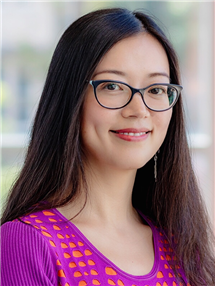
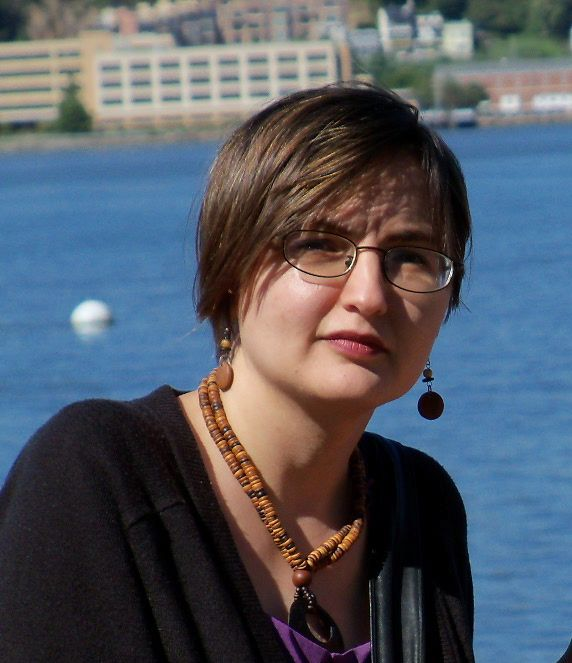
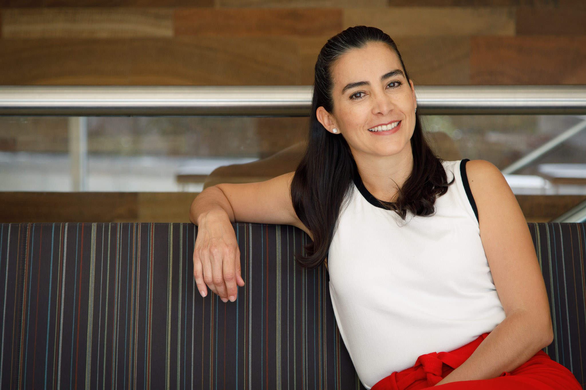
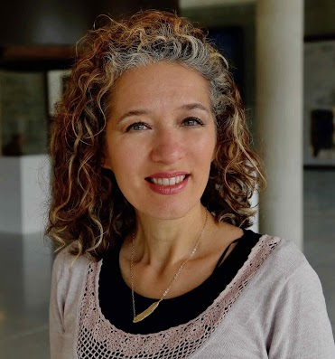



Officers
--------

|            |                  |                                            |           |
|------------|------------------|--------------------------------------------|-----------|
| Chair      | Luciana Benotti  | Universidad Nacional de Córdoba            | 2022-2023 |
| Secretary  | Heng Ji          | University of Illinois at Urbana-Champaign | 2022-2023 |
| Treasurer  | Jonathan May     | University of Southern California / ISI    | 2021-2022 |
| Past Chair | Colin Cherry     | Google                                     | 2022-2023 |

Executive Board
---------------

|              |                             |                                            |           |
|--------------|-----------------------------|--------------------------------------------|-----------|
| Board Member | Graham Neubig               | Carnegie Mellon University                 | 2021-2022 |
| Board Member | Anna Rumshisky              | University of Massachusetts Lowell         | 2022-2023 |
| Board Member | Thamar Solorio              | University of Houston                      | 2022-2023 |
| Board Member | Diyi Yang                   | Georgia Institute of Technology            | 2022-2023 |                                         

<!-- Ex-Officio Board Members
------------------------

|               |                       |                          |           |
|---------------|-----------------------|--------------------------|-----------|
| ACL Treasurer | David Yarowsky        | Johns Hopkins University | 2018-2022 | -->

Nominating Committee
--------------------
- Ellen Riloff (chair)
- Emily M. Bender
- Joyce Chai
- Marie-Catherine de Marneffe
- Philip Resnik
- Marilyn Walker
- Luke Zettlemoyer

Chair (2022-2023) | [Luciana Benotti](https://benotti.github.io/) | Universidad Nacional de Córdoba
----------------------------------------------------------------------------------------

<!--  -->

#### Bio

Luciana Benotti is an Associate Professor at the Department of Computer Science in the Universidad Nacional de Córdoba, in Argentina. Her research interests cover many aspects of situated dialogue, including the study of misunderstandings, clarification requests and grounding. She has a PhD in Computer Science from INRIA, Nancy Grand Est, France. She received an IBM SUR award for her work on robust conversational interfaces, and a Google RISE award for her outreach efforts in developing AI-based technology for education. She has been an invited scholar at the University of Trento (2019), Stanford University (2018), Roskilde University (2014), University of Lorraine (2013), Universidad de Costa Rica (2012), and University of Southern California (2010). She regularly serves under different roles in the ACL community. She has been a volunteer during conferences, a reviewer since 2010, an area chair for dialogue and interactive systems several times, and a member of the executive board of SIGDIAL and SIGSEM. She is currently an elected officer at the NAACL executive board for 2021 and 2022. She is also serving as ARR action editor, ACL 2022 tutorial chair and NAACL 2022 D&I advisor.

#### Candidacy Statement

If I am elected as chair of the board, I will keep working actively towards maintaining the high quality of the *CL conferences, while focusing on supporting diversity and inclusion. As a Latinamerican researcher, I know first hand the serious problems that overlooking these issues provoke. I will coordinate NAACL exec board responsibilities in collaboration with the ACL. I will continue enabling the initiatives I proposed as an officer, which have made good progress in this short time thanks to the work of the current NAACL exec board and the ACL community.  

- Care about ethics: I will support the continued inclusion of an ethical impact statement for all papers submitted to *CL conferences. Such statements should not only consider privacy, gender and race, but also take economy, power and climate into account. I will work towards improving the ethical reviewing through consensus in the community, serving as one of the Members at Large of the newly-formed ACL Ethics Committee. 

- Encourage reproducibility: I will continue to explore incentives to encourage the release of implementation code, data, metadata, and trained models required to reproduce the results of all papers submitted to NAACL. These measures would not only improve transparency, but they would help researchers with low computing budgets implement their ideas and help reduce carbon footprint. I will support the publication of reproducibility studies, in particular when applied to languages other than English. 

- Lower barriers: I will continue to strengthen diversity and inclusion initiatives at NAACL from different perspectives. In particular, I will work towards increasing the amount of fee waivers and strive to get travel grants for those who face financial barriers. Moreover, during the pandemic the organization of virtual conferences has successfully increased participation of underrepresented communities, and I will investigate and measure the impact of hybrid alternatives in the future. 

- Build community: I will support initiatives that broaden and strengthen NAACL´s community.  Many successful community building activities are already rolling (e.g., Birds of a feather, ACL mentoring, WiNLP, RAF, Masakane, Queer and LatinX in AI, among others). The next step is to improve communication lines and coordinate joint efforts so that they benefit from each other. 

Secretary (2022-2023) | [Heng Ji](http://blender.cs.illinois.edu/hengji.html) | University of Illinois at Urbana-Champaign
--------------------------------------------------------------------------------------------------------------------------

<!--  -->

#### Bio

Heng Ji is a professor at Computer Science Department, and an affiliated faculty member at Electrical and Computer Engineering Department of University of Illinois at Urbana-Champaign. She is an Amazon Scholar. She received her B.A. and M. A. in Computational Linguistics from Tsinghua University, and her M.S. and Ph.D. in Computer Science from New York University. Her research interests focus on Natural Language Processing, especially on Multimedia Multilingual Information Extraction, Knowledge Base Population and Knowledge-driven Generation. She was selected as "Young Scientist" and a member of the Global Future Council on the Future of Computing by the World Economic Forum in 2016 and 2017. The awards she received include "AI's 10 to Watch" Award by IEEE Intelligent Systems in 2013, NSF CAREER award in 2009, Google Research Award in 2009 and 2014, IBM Watson Faculty Award in 2012 and 2014, Bosch Research Award in 2014-2018, Best-of-ICDM2013 Paper, Best-of-SDM2013 Paper, ACL2020 Best Demo Paper Award, and NAACL2021 Best Demo Paper Award. She is elected as the North American Chapter of the Association for Computational Linguistics (NAACL) secretary 2020-2021. She has served as the Program Committee Co-Chair of many conferences including NAACL-HLT2018, and she has been the coordinator for the NIST TAC Knowledge Base Population track since 2010.

#### Candidacy Statement

In the past one and a half years, I have run the NAACL election in a well-organized, fair and transparent format, with the great help from the nomination committee and the ACL Information Technology Director Dr. Nitin Madnani. I have handled external communications through the NAACL website, mailing lists and social media in a clear and timely manner, and took meeting notes. I have constructed a repository of guidelines and materials for PC chairs, and built "ReviewRobot", an automatic paper scoring and review generation system [Wang et al., INLG2020] which can potentially serve as a review assistant. I have also started building a Who's Who knowledge base for NLP researchers using the information extraction and knowledge base population techniques that my research group has developed. I would appreciate the opportunity to serve for another term as NAACL secretary so I could have sufficient time to wrap up and release the PC chair material repository, and work with NAACL and ACL executive committees to figure out the best way to integrate and utilize the ReviewRobot and the NLP Who's Who KB in NAACL/ACL platforms.

Treasurer (2021-2022) | [Jonathan May](http://jonmay.net) | University of Southern California / Information Sciences Institute
------------------------

<!--  -->

#### Bio

Jonathan May is a Research Assistant Professor in the Computer Science Department of the Viterbi School of Engineering at the University of Southern California, as well as a Research Lead with USC’s Information Sciences Institute, where he received a PhD in 2010. He has previously worked at BBN Technologies and at Language Weaver (now SDL Research). His interests include automata theory, machine translation, common-sense reasoning, semantic parsing, and dialogue. He is currently treasurer of NAACL. Jon previously served as workshop co-organizer and task organizer of SemEval from 2016 to 2019, handbook chair for NAACL 2018, social media co-chair for NAACL in 2016, and local arrangements co-chair for NAACL in 2010.

#### Candidacy Statement

Thank you for considering me for an additional term as NAACL treasurer. The past two years have been fun and productive ones, as I’ve learned more about NAACL’s financial health, implemented changes to improve efficiency, given advice to mitigate risk while supporting interests critical to our community, and weathered the current crisis. I look forward to building on the past term’s learning experience and continuing to keep NAACL financially sound.

Apart from our annual conference, NAACL continues to support NACLO, to promote CL/NLP awareness at the high school level. We provide scholarship funds for the JSALT summer workshop series. And we sponsor initiatives in emerging regions of the Americas via the ERF. As a member of the ERF committee, I am proud that we have been able to maintain funding levels even in a time of uncertainty and have sponsored worthwhile projects in Brazil, Peru, Mexico, and Colombia. And we have innovated our sponsorship payment process to speed up international transactions and reduce international exchange fees.

My goal for the coming term is to expand our support of these and other worthy causes that promote the equitable expansion of research in natural language processing and computational linguistics. Thanks to our hardworking ACL treasurer David Yarowsky and ACL business manager Priscilla Rasmussen, ACL is resolving long-standing uncertainties with regard to its financial health that have necessitated caution in our spending. With these uncertainties resolved, NAACL will be able to expand its support to increase NACLO, JSALT, and ERF participation, which exposes as wide a population in the Americas as possible to our field. When travel resumes, I will suggest we use available NAACL funds to facilitate low-cost conference child support and provide conference travel grants. In this way we will work toward ensuring that lack of money does not equate to lack of access.

Past Chair (2020-2021) | [Colin Cherry](https://sites.google.com/site/colinacherry/) | Google
----------------------------------------------------------------------------------------

<!--  -->

#### Bio

Colin Cherry is a Research Scientist at Google in Montreal. Previously, he
worked at Natural Research Council Canada and Microsoft Research. He received
his Ph.D. in Computing Science from the University of Alberta. His primary
research area is machine translation, but he has been known to venture into
parsing, morphology and information extraction. He is currently secretary for
the NAACL and an action editor for the Transactions of the ACL. He has served as
a workshop chair for HLT-NAACL 2012, as a publications chair for HLT-NAACL 2013,
on the editorial board of Computational Linguistics from 2013 to 2015, and as an
area chair for ACL 2014, IJCNLP 2017 and EMNLP 2019. He co-organized the
Workshop on Deep Learning Approaches for Low-Resource NLP (DeepLo) in 2018 and
2019, and he was Research Program co-chair for the conference of the Association
for Machine Translation in the Americas (AMTA) in 2018.

#### Candidacy Statement

From what I have seen, the role of the NAACL chair is threefold: first to keep
the NAACL board on track with its recurring responsibilities of conference
organization and community outreach, second to act as a liaison between the
NAACL and the ACL, and third to enable and amplify the great ideas of NAACL’s
board members. As a chair candidate, my primary advantage is having served as
secretary for two great NAACL chairs. Over the past four years, I have watched
them do these things expertly, and if selected as chair I will endeavour to do
the same.

In terms of a platform, I mostly offer continuity and stability. These are
extraordinary times for natural language processing, and I have no illusions
about the amount of effort required just to scale our conferences and outreach
to match our field’s rapid growth. I will continue to support NAACL’s widespread
efforts to make its conferences more inclusive, by reducing financial barriers
for disadvantaged groups, continuing to refine our strategies for
family-friendliness, and improving the accessibility of our venues. I also
intend to prioritize a careful discussion of how to handle remote presentation
properly and consistently. Reviewing, of course, remains an ongoing concern as
we attempt to scale our processes to an ever-growing flood of submissions. I
will ensure that the NAACL board remains actively engaged in this discussion as
it continues in our community and in those of our neighbouring fields.

Board Member (2021-2022) | [Graham Neubig](http://www.phontron.com) | Carnegie Mellon University
------------------------------------

<!--  -->

#### Bio

Graham Neubig is an associate professor at the Language Technologies Institute of Carnegie Mellon University. His work focuses on natural language processing, specifically multi-lingual models that work in many different languages, and natural language interfaces that allow humans to communicate with computers in their own language. Much of this work relies on machine learning, and he is also active in developing methods and algorithms for machine learning over natural language data. He publishes regularly in the top venues in natural language processing, machine learning, and speech, and his work has won awards at EMNLP 2016, EACL 2017, and NAACL 2019. He has served on the NAACL board for the 2019-2020 term.

#### Candidacy Statement

I first ran for the NAACL board in 2018 on a platform of improving two things regarding our conferences and publishing. The first was regarding remote participation in conferences, with the goal of reducing the barrier of entry for researchers who are not able to participating in conferences personally due to financial or visa issues. The silver lining on the cloud of the COVID situation is that it forced our hand on remote conferences, and I now believe that the infrastructure is in place. If elected to a second term, I will advocate for continuing to provide a comprehensive remote participation experience even after we transition back to in-person conferences. The second issue was improvement of our reviewing processes, with the goal of improving efficiency and reviewing quality. I am continuing to advocate for this through participation in the ACL reviewing committee, where I have developed software for reviewer-paper matching (which has been used at ACL 2020 and EMNLP 2020), and also created proposals for rolling review that are under consideration for the ACL as a whole. If elected, I would like to use my position on the NAACL exec to continue advocating for improvements in the reviewing processes for NAACL conferences and the ACL as a whole.

Board Member (2022-2023) | [Aline Villavicencio](https://sites.google.com/view/alinev/) | University of Massachusetts Lowell
------------------------------------

<!--  -->

#### Bio
Aline Villavicencio is a Professor in the Department of Computer
Science, University of Sheffield (UK) also affiliated to the Federal
University of Rio Grande do Sul (Brazil). Her research interests
include lexical semantics and multiword expressions, multilinguality,
and cognitively motivated NLP. She received her MSc from the Federal
University of Rio Grande do Sul (Brazil), PhD and MPhil from
the University of Cambridge (UK), and held postdoc positions at the
University of Cambridge and University of Essex (UK) and was a
Visiting Scholar at institutions like the Massachusetts Institute of
Technology (USA) and ?cole Normale Sup?rieure (France). She serves as
editorial board member for TACL, JNLE, Journal of Language Modelling
and Linguamatica, as well as Book Review Editor for Computational
Linguistics. She is the PC co-chair of ACL-2022, was the PC co-chair
for CoNLL-2019, General co-chair for the 13th Int. Conf. on
Computational Processing of Portuguese (PROPOR 2018), and has been SAC
and AC for events including *ACL conferences, IJCAI and AAAI. In
addition, she co-chaired numerous *ACL workshops on Cognitive Aspects
of Computational Language Acquisition and on Multiword Expressions,
and co-edited special issues and books dedicated to these topics. She
is also a member of the advisory board of WiNLP.

#### Candidacy Statement
Many thanks for considering me for an additional term as NAACL board
member. The first term has provided an extremely interesting
opportunity to get involved in NAACL activities and its presence
within our various communities, in particular as a member of
the Regional Americas Fund (RAF) committee. For the second term, my
plan is to continue to work towards promoting and supporting
initiatives, like WiNLP, for increasing diversity and inclusion of
underrepresented NLP communities, supporting the growth of programs,
like the Regional Americas Fund (RAF) and the amazing actions that it
supports throughout the Americas, with its rich ecosystem of languages
(and cultures) and the brave communities that have worked for their
documentation and processing, often in (very) low-resourced
settings. This also includes helping to promote opportunities for
supporting language diversity in our events, to increase visibility
and dissemination of regional efforts and help to strengthen links and
fostering collaborations among the communities. In addition, I will
continue to support greater presence of interdisciplinary initiatives
in NAACL events for facilitating interactions that include a diversity
of areas.

Board Member (2022-2023) | [Thamar Solorio](http://solorio.uh.edu/) | University of Houston
------------------------------------

<!--  -->

#### Bio
Thamar Solorio is professor in the Department of Computer Science at
the University of Houston (UH). Her main research interests include
information extraction for user generated data, NLP for linguistically
diverse speakers, and more recently, multimodal processing of text and
video.  She has M.S. and PhD degrees in Computer Science from INAOE,
Puebla, Mexico. Her research program has been supported by the
Department of Defense, the National Science Foundation, the Office of
Naval Research, and ADOBE Inc. She is the recipient of an NSF CAREER
award for her work on authorship analysis. She is also a recipient of
the 2014 Emerging Leader ABIE Award in honor of Denice Denton. She
serves as editorial board member for the Computer Speech and Language
Journal. She has served as reviewer and area chair to ACL, NAACL,
AAAI, among others, and was program co-chair for NAACL 2019.

#### Candidacy Statement
I was elected to the board during a difficult 2020, and sadly I wasn't
able to really achieve much in terms of my stated goals for
NAACL. Meanwhile, ACL and NAACL have made important progress towards a
more inclusive community, and if reelected I would work to support and
extend these efforts.

I would like to help implement a tiered conference registration where
medium and large tech companies pay higher registration prices than
participants from non-profit institutions. The goal is to spend the
additional funds collected through registration to increase access to
the conference in the form of more travel grants, infrastructure
support for virtual components, individual flexible grants for
individuals with unique challenges to attend the conference (paying
extra hours for childcare at home, airfare for child care provider,
etc.), and augment funds allocated for the NAACL Regional Americas
Fund, as well as to explore the creation of additional supporting
initiatives. One idea is to create a NAACL distinguished speaker
series, where well established researchers commit to travel to a
region typically underrepresented in our community to give a tutorial
and interact with the research community in that place.

Additionally, this year I would also like to explore approaches that
foster a more synergistic collaboration and involvement of industry
and academia/non-profit organizations. The scale of resources needed
nowadays to explore deep learning approaches that continue to deliver
successful results is aggravating disparity for researchers with
limited access to these resources. One solution is to mentor our
reviewers to value contributions that are not the expected large
models, and our community is already making great progress in this
respect, for example with submission tracks dedicated to NLP for
under-resourced languages. We should do more, not to slow down the
progress of large models, but to protect the intellectual value and
creativity of research ideas that are critically needed to secure the
sustained growth of NLP communities world-wide, and the advancement of
NLP technology in all regions of the world. A good initial step
towards this goal would be to establish targeted discussions with
researchers from underrepresented communities and form an accurate
understanding of their research environments, needs, and the best ways
in which industry and big labs can collaborate to support these
communities.

Board Member (2022-2023) | [Diyi Yang](https://www.cc.gatech.edu/~dyang888/) | Georgia Institute of Technology 
------------------------------------

<!--  -->

#### Bio
Diyi Yang is an assistant professor in the School of Interactive
Computing at Georgia Institute of Technology. She received her PhD
from the Language Technologies Institute at Carnegie Mellon University
in 2019. Her recent research interests focus on computational social
science, learning with limited data, dialogue summarization, and
responsible NLP for social good.  She is a recipient of Forbes 30
under 30 in Science, a winner of IEEE "AI 10 to Watch" award, and a
Microsoft Research Faculty Fellow. She co-organized the Widening NLP
(WiNLP) workshops at NAACL 2018 and ACL 2019, and has served as area
chairs for NAACL, EMNLP and ACL.

#### Candidacy Statement
Recently, there has been exciting and rapid growth in our NAACL
community, which has attracted a growing number of participants from
various research communities, cultures, and countries. If elected as a
board member, I would like to work towards a more diverse and
inclusive NAACL through the following initiatives:

- Promoting interdisciplinary work: One of my goals is to help
promote more interdisciplinary research within the NAACL community,
by coordinating joint tutorials or workshops with communities such as
Computer Vision, Robotics, HCI and Social Science, and improving the
review criteria/process for these interdisciplinary works.

- Establishing programs to highlight early career researchers: I
would like to work towards establishing Highlights Programs for new
faculty or researchers in industry, to provide them with
opportunities to connect with peers, get advice (e.g., teaching,
student supervision) from senior colleagues, gain visibility, and
engage with our NLP community by active participation in various ways
and capacities.

- Supporting undergraduate students and high school students: I
would like to help figure out ways on how we can attract and support
undergraduates and high school students into NLP, e.g., via
establishing summer school programs or certain funded programs that
offer free registration and travel awards.

- Increasing language support for non-native English speakers: I
hope to work towards more language inclusive communities, via efforts
to support both non-native English presenters and attendees (e.g.,
during Q&A, writing support, and etc.).

